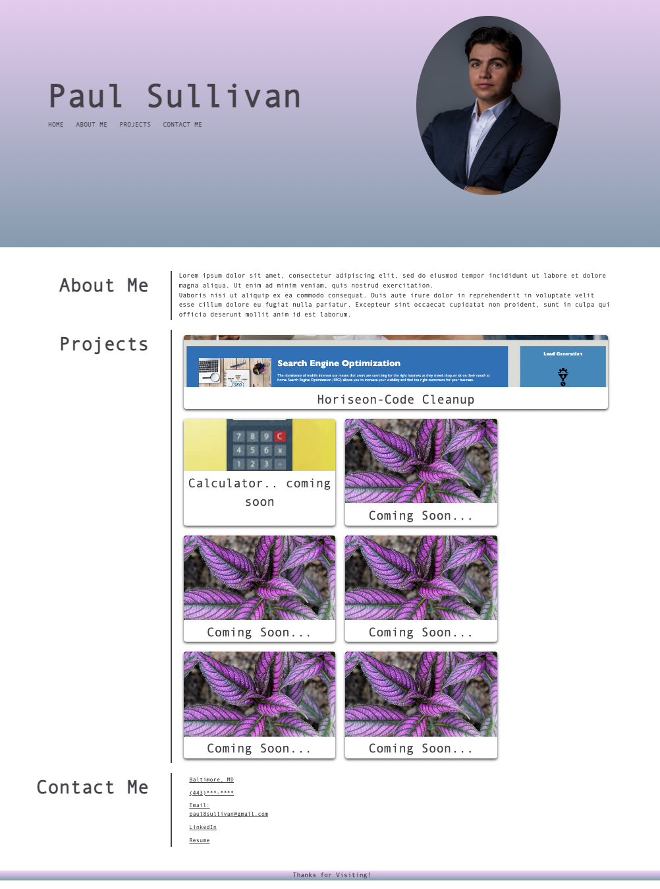

# Paul-myPortfolio

Solo project to develop a webpage to eventually house notable projects during my coding career. This is for potential employers to review samples of my work and assess whether I am a good candidate for an open position.

## Acceptance Criteria

* It is done when presented with the developer's name, a recent photo or avatar, and links to sections about them, their work, and how to contact them.

* It is done when I click one of the links in the navigation and the the UI scrolls to the corresponding section.

* It is done when I click on the link to the section about their work, the UI scrolls to a section with titled images of the developer's applications.

* It is done when the first application image should be larger in size than the others.

* When I click on the application, I am taken to that deployed application.

* When I resize the page or view the site on various screens and devices, I am presented with a responsive layout that adapts to my viewport.

## ReadME

In this assignment I was able to order HTML and CSS code to follow a logical structure. I created a portfolio that has important information for future employers. The webpage is interactive and adapts to different size viewports.

## Notes

Used Google (https://www.google.com/)

Used W3 Schools (https://www.w3schools.com/)

## Assets

The following image demonstrates the web application's appearance:

This following is a link to the deployed application:

https://pauljsully.github.io/Paul-myPortfolio/

